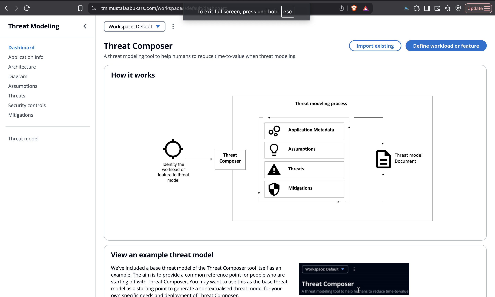
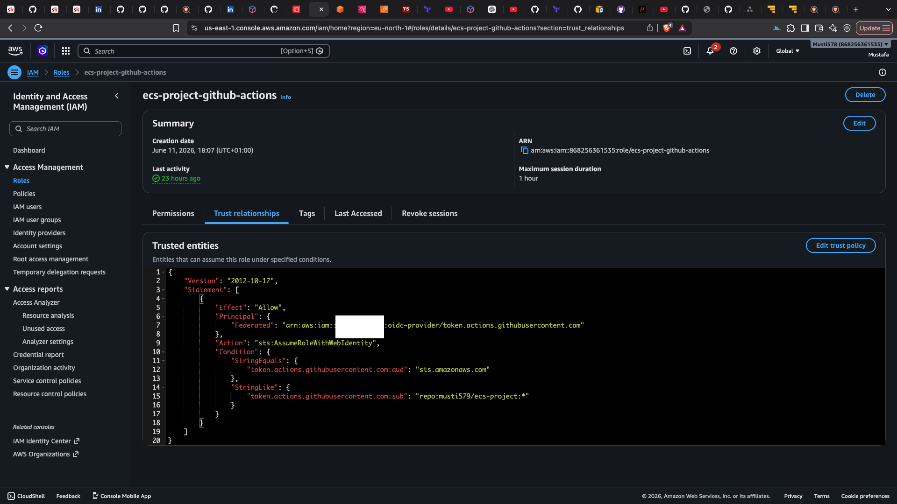

# Production Style Deployment of a React Single Page Application on AWS

A production style deployment of a React single page application (SPA) on AWS using Amazon ECS Fargate, Terraform, and GitHub Actions.

The application is containerised with Docker and deployed to Amazon ECS Fargate behind an Application Load Balancer. Container images are stored in Amazon ECR and released using ECS rolling deployments, while Route 53 and ACM provide DNS routing and TLS termination.

Infrastructure is managed through reusable Terraform modules covering networking, load balancing, ECS, IAM, ACM, and DNS management. Terraform state is stored remotely in Amazon S3 with native state locking enabled.

GitHub Actions authenticates to AWS through OpenID Connect (OIDC), allowing workflows to assume IAM roles using temporary credentials instead of long lived AWS access keys.

# Architecture

Route 53 routes traffic from the custom domain to an Application Load Balancer. The load balancer terminates TLS using an ACM certificate and redirects HTTP traffic to HTTPS.

Traffic is forwarded to an ECS Fargate service running container images stored in Amazon ECR. ECS maintains the desired task count and performs rolling deployments when new task definitions are deployed.

Application logs are sent to CloudWatch Logs, while security groups restrict traffic between the load balancer and ECS tasks.

Infrastructure is provisioned through Terraform modules for VPC, ALB, ECS, IAM, ACM, and Route 53. Terraform state is stored remotely in Amazon S3 with native state locking enabled.

# High level architecture


#  Live Application




#  OIDC Trust Policy

GitHub Actions authenticates to AWS using OpenID Connect (OIDC). The IAM trust policy restricts role assumption to the repository, allowing workflows to use temporary credentials instead of long lived AWS access keys.



# Getting Started

## Prerequisites

* AWS account
* Registered domain in Route 53
* Terraform
* AWS CLI
* Docker
* GitHub repository access

## Deploying the Infrastructure

Infrastructure is provisioned through Terraform modules from the terraform/ directory.

The bootstrap configuration is applied first to create foundational resources, including the S3 backend, ECR repository, OIDC integration, and IAM roles used by the CI/CD pipelines.

```bash
terraform init
terraform plan
terraform apply
```

This provisions the VPC, Application Load Balancer, ECS cluster and service, IAM roles, Route 53 records, ACM certificate, and supporting resources.

## Building and Pushing the Application

The CI workflow builds a Docker image, authenticates to AWS using OIDC, and pushes the image to Amazon ECR.

## Deploying to ECS

The deployment workflow retrieves the current ECS task definition, updates the container image, registers a new task definition revision, and updates the ECS service.

ECS performs a rolling deployment and maintains service availability while replacing running tasks.


# CI/CD Pipeline

GitHub Actions is used to automate image builds, infrastructure validation, and application deployments. All workflows authenticate to AWS using OpenID Connect (OIDC), allowing temporary AWS credentials to be issued at runtime without storing long-lived access keys.

## Build and Push Workflow

The build workflow authenticates to AWS, builds a Docker image using Docker Buildx, performs a vulnerability scan using Grype, and pushes the image to Amazon ECR.


## Deploy to ECS Workflow

The deployment workflow retrieves the current ECS task definition, updates the container image, registers a new task definition revision, and updates the ECS service.


ECS performs a rolling deployment, replacing running tasks with the new version while maintaining service availability.

## Terraform Workflow

The Terraform workflow performs validation and security checks before generating a Terraform execution plan against the remote S3 backend.


# Repository Structure


```text
react-spa-on-aws/
├── .github/
│   └── workflows/
│       ├── build.yaml      # Build and push Docker image to ECR
│       ├── deploy.yaml     # Deploy updated task definition to ECS
│       └── terraform.yaml  # Validate, scan, and plan Terraform changes
├── build/
├── config/
├── images/
├── public/
├── src/
├── terraform/
│   ├── bootstrap/          # One-time setup: S3 backend, ECR, OIDC, IAM roles
│   ├── modules/
│   │   ├── acm/
│   │   ├── alb/
│   │   ├── ecs/
│   │   ├── iam/
│   │   └── vpc/
│   ├── main.tf
│   ├── output.tf
│   └── provider.tf
├── Dockerfile
├── package.json
├── README.md
└── .gitignore
```

# Areas for Improvement

* Move ECS tasks into private subnets to further reduce exposure to the public internet.

* Implement blue/green deployments using AWS CodeDeploy to provide safer releases and faster rollback capabilities.

* Introduce separate development, staging, and production environments to improve testing and release management.

* Add CloudWatch Alarms and notifications to improve monitoring and operational visibility.

* Continue refining IAM policies to ensure permissions follow the principle of least privilege.


